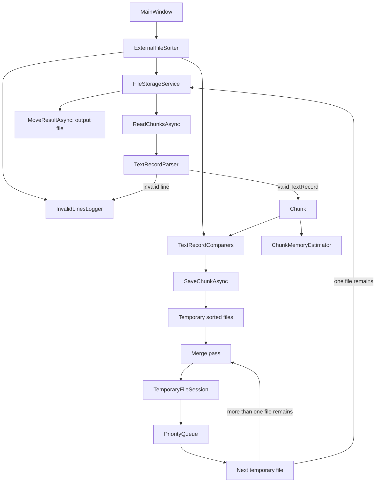

# 3dEYE Test Assignment

Windows desktop solution for generating and externally sorting large UTF-8 text files.

## Applications

- `FileGenerator` creates a random text file no smaller than the requested size.
- `FileSorter` sorts a file that may be too large to fit into RAM.

## File format and sorting rules

Each valid input line has the form:

```text
<Number>.<String>
```

Examples:

```text
415.Apple
415. Apple
12.Version 1.2
```

- `Number` is a non-negative `Int32`.
- The first dot separates the number and text. Later dots, as well as spaces after the dot, are part of the text.
- Invalid rows are skipped and recorded in a timestamped `invalid-lines-<date>.log` beside the output file. No log is left behind when all rows are valid.
- The ordering is: text using ordinal, case-sensitive comparison; then number in ascending order; then original line order for equal keys.

## FileGenerator

The generator writes random numbers and text with `Random.Shared`. A small pool of repeated text values is selected with a fixed probability, so sufficiently large generated files contain duplicates.

Generation writes to a unique `.partial` file first and moves it to the selected destination only after successful completion. Cancellation or failure removes the temporary file.

The size value is calculated as `1,024 × 1,024` bytes per entered megabyte, so `100` produces at least `104,857,600` bytes. Generated files use UTF-8 without BOM.

## FileSorter

The sorter uses an external stable merge sort. The services interact as follows:



`Memory per worker` sets a soft limit for an in-memory chunk. One unusually large line is still processed as a chunk of its own. `Workers` limits how many chunks are sorted concurrently.

During merging, the sorter opens only a memory-fitting group of temporary files. It keeps one parsed record from each active input file in a priority queue, writes the smallest record, then reads the next record from that same file. The size of each merge group is derived from the total configured memory budget, stream buffers, and the largest record in each file.

Temporary files are created beside the selected output, inside a unique working directory. They are deleted after a successful merge and the working directory is removed after completion, cancellation, or failure. The sorter accepts an optional UTF-8 BOM in an input file, but writes temporary, output, and log files as UTF-8 without BOM.

### Service responsibilities

- `ExternalFileSorter` coordinates chunk creation, parallel sorts, merge passes, progress, cancellation, and cleanup.
- `FileStorageService` reads input chunks, writes sorted chunks, creates working directories and paths, moves the final result, and deletes temporary files.
- `TextRecordParser` validates an original line and builds a `TextRecord` without copying its text portion.
- `TextRecordComparers` applies ordinal text comparison, numeric comparison, and the stable tie-breaker.
- `ChunkMemoryEstimator` estimates managed memory for a parsed row to split input into chunks.
- `TemporaryFileSession` owns all readers and the writer within one merge operation. It reads one row at a time from each active input file.
- `PriorityQueue` keeps one current row from each active input file; after writing the smallest row, the session reads only the next row from that same file.
- `InvalidLinesLogger` is created lazily and receives only invalid input rows.

## Tests

`FileGenerator.Tests` covers settings validation, generated-file format and size, UTF-8 without BOM, cancellation, and temporary-file cleanup.

`FileSorter.Tests` covers parsing, stable ordinal comparison, invalid-row logging, UTF-8 BOM input, memory boundaries, multi-pass merging, output protection, and cancellation cleanup.

Run the test projects separately:

```powershell
dotnet test FileGenerator.Tests\FileGenerator.Tests.csproj
dotnet test FileSorter.Tests\FileSorter.Tests.csproj
```
